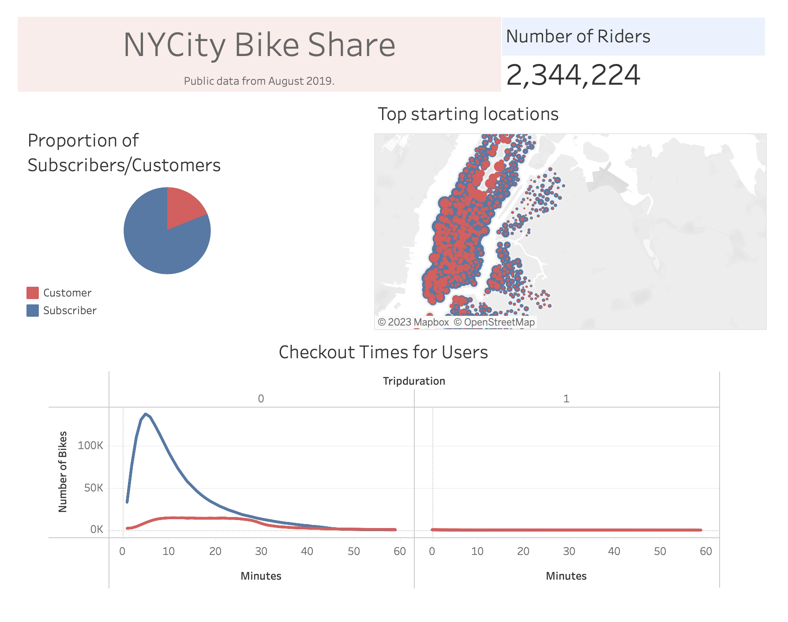
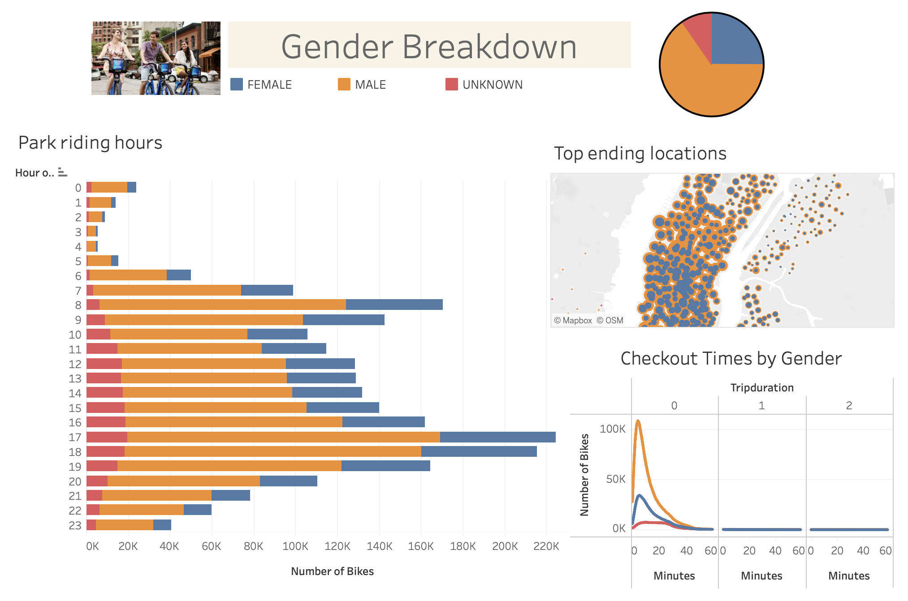
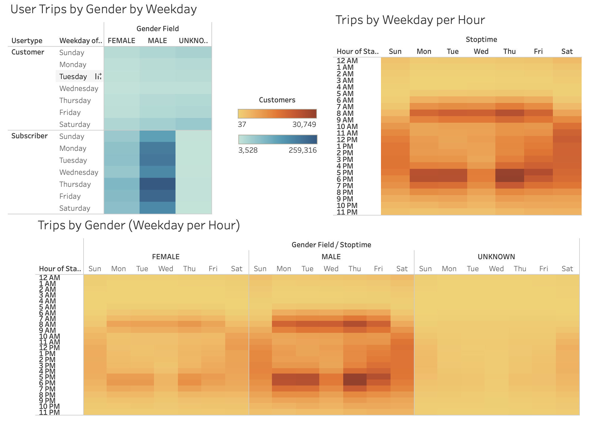

# Extrapolating New York City Bikes Analysis to Des Moines 

Making use of visualization tools such as Tableau, data could be presented and the insights of the findings could be shared in a easy way.

The following pictures represent the visualizations made on the data of the new york city bikesharing services for the month of August of 2019.

## Summary 

The bikesharing program reported more than 2 million users for the month, which is a good representation for approximately +8.3 million for the census in 20191, if its assumed that most of the users are locals. From the heatmaps, it could be seen a pattern of usage of citybikes on the commute hours for 9-5 jobs, indicating a lot of people use this service as transportation method to go to work. 

On the other hand,the city of Des Moines with a population of 214,2372, a median resident age 35-36 years3 (similar for both cities) and 0.4% bicycle used as a transportation method4, is the target of a solid business proposal. 

Comparing this cities it could be made a fair assuption that a well built bikesharing service will be used by similar proportion of users on Des Moines, resulting in a rough number of 60k potential users to be part of this service. 

Visualization (Tableau)

[Link to Visualization](https://public.tableau.com/views/MyNYCityBikes/NYCityBikeShare?:language=en-US&publish=yes&:display_count=n&:origin=viz_share_link)

<ol>
<li>https://www1.nyc.gov/assets/planning/download/pdf/planning-level/nyc-population/new-population/current-populatiion-estimattes.pdf</li>
<li>https://www.city-data.com/city/Des-Moines-Iowa.html</li>
<li>https://www.census.gov/quickfacts</li>
<li>https://dmampo.org/wp-content/uploads/2015/04/congestion_mode_share-2016-7282016.pdf</li>
</ol>
